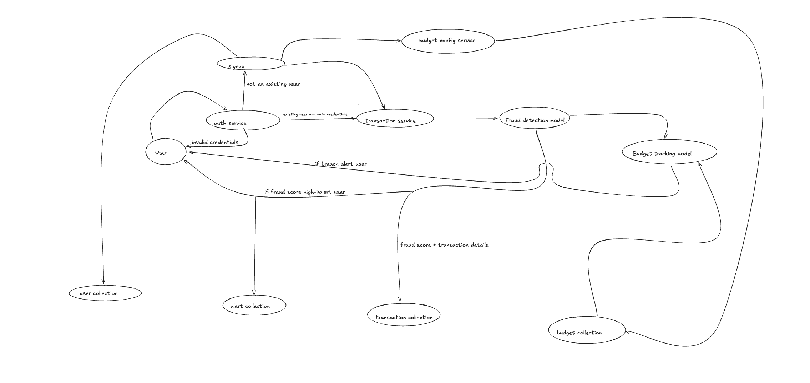

Presenting you Fintellect.

A finance manager for your company as well as independently for you.

Features:
    1. Fraud detection by abnormal transaction tracking.
    2. Tentative Expenditure for this month category wise.
    3. Alerts for safety and anamoly detection.
    4. Alerts for budget breach.

Tech-stack:
    Frontend:
        React.js along with libraries for data visualisation
    
    Backend:
        Node.js
        Express.js
        Socket.io
        BullMQ+Redis
        Mongoose
    
    Database: MongoDB- MongoDb Atlas is used for cloud database

    ML:
        Upcoming
    

DB design:
    USER:
        _id
        name
        username
        hashedPassword
        role
        createdAt
    
    TRANSACTIONS:
        _id
        userID
        type(debit/credit)
        amount
        category
        status(success/failed/flagged)
        fraudScore(to be added later)
        createdAt
        updatedAt
    
    BUDGET:
        _id
        userID
        category
        monthlyLimit
        createdAt
        updatedAt
    
    ALERT:
        _id
        userID
        type(fraud/budget/system)
        message
        relatedTransactionID(optional)
        isRead
        createdAt

    ML metadata:
        To be added later

USE CASE DIAGRAM:

